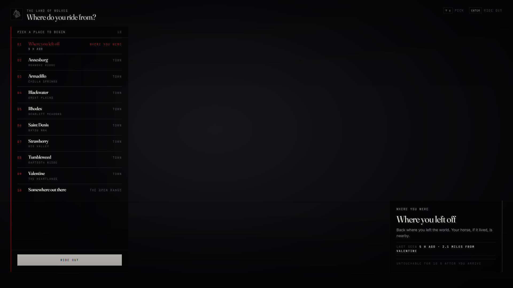
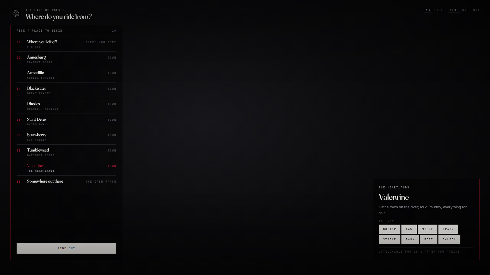

<!--
    lxr-spawn — LXRCore spawn selection
    Developer: iBoss21 / LXRCore · https://www.lxrcore.com
    © 2026 iBoss21 / LXRCore | lxrcore.com | All Rights Reserved
-->

# lxr-spawn — folded into lxr-creator

> **Retired on 2026-09-19.** The spawn step (towns with place cards, where you
> left off with last-seen and distance, the open range, the fly-over camera and
> arrival protection) is now the last page of
> [lxr-creator](https://github.com/LXRCore/lxr-creator) 3.1 — `Config.Spawn`,
> `shared/spawn.lua`, `server/spawn.lua`, `client/spawn.lua`. One page, one
> resource, no hand-off event. Do not run both.

The code below stays for reference only.

---

# lxr-spawn — Spawn selection for LXRCore v3

After `lxr-creator` selects or creates a character it fires
`lxr-spawn:client:setupSpawnUI(cData, isNew)`. This resource asks the server
for the allowed options, lets the player pick one with a fly-over camera and
performs the teleport the **server** ordered.

## What the player gets

* **Where you left off** — with when they were last seen and how far from the
  nearest town (`last_updated` on the players row; nothing else is stored).
* **Towns** in label order, each with its region under the name and a card on
  the right: a line about the place and what is in town (doctor, law, store,
  train, stable, bank, post, saloon). Points can be restricted to jobs.
* **Somewhere out there** — the server picks; the client never learns the
  coordinates of anything it did not choose.
* **Arrival protection** — untouchable for `Config.Protection.seconds` after
  the teleport, with a toast before it ends, so nobody camps a spawn.
* Fly-over camera on hover, arrow keys + Enter, both kit themes, EN / KA.

## How it stays honest

The NUI sends an **id**; the server resolves it from `Config.Spawns` /
`Config.FirstSpawns` / the saved position and rejects anything else
(`LXRCore.Log.exploit`). Controls are locked only while the picker is open.

## Config

`Config.Spawns` (existing characters) and `Config.FirstSpawns` (new characters):
`label`, `region`, `coords`, `services = { … }`, optional `jobs = { 'vallaw' }`.
The card's line about each place is `place.<id>` in `locales/`.
`Config.General.allowLastPosition / allowRandom / skipUIWhenSingle / lastSeen /
newCharacterEvent`, `Config.Protection.seconds / warnAt`, camera heights.

## Events

| Name | Side | |
|---|---|---|
| `lxr-spawn:client:setupSpawnUI(cData, isNew)` | client | open the chooser |
| `lxr-spawn:server:options(isNew)` | callback | option list for the loaded character |
| `lxr-spawn:server:choose(id)` | net | validated choice |
| `lxr-spawn:client:spawnAt(coords, isNew)` | client | teleport ordered by the server |
| `lxr-spawn:server:spawned(src, id, coords, isNew)` | server | for other resources |

After the teleport the client fires `LXRCore:Server:OnPlayerLoaded` and
`LXRCore:Client:OnPlayerLoaded` (the framework's spawn signal).

> © 2026 iBoss21 / LXRCore | [lxrcore.com](https://www.lxrcore.com) | All Rights Reserved
